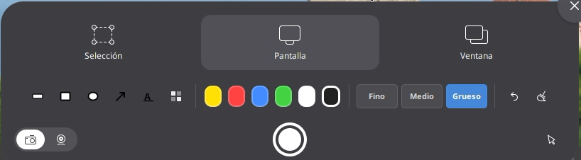

# 📸 Screenshot Annotator

Extensión para GNOME Shell 49 que agrega herramientas de anotación **directamente dentro del panel de captura de pantalla nativo** de GNOME. Sin ventanas separadas, sin apps externas — las herramientas aparecen integradas en la misma UI que se abre al presionar `PrintScreen`.



---

## ✨ Características

| Herramienta | Descripción |
| :---: | --- |
|  | **Resaltado**: Resalta áreas específicas. |
|  | **Rectángulo**: Dibuja bordes rectangulares. |
|  | **Elipse**: Dibuja elipses y círculos perfectos. |
|  | **Flecha**: Dibuja flechas para señalar elementos. |
|  | **Texto**: Inserta anotaciones de texto. |
|  | **Pixelado**: Censura regiones sensibles. |

- 🎨 **6 colores** predefinidos (amarillo, rojo, azul, verde, blanco, negro)
- 📏 **3 grosores** de trazo (fino, medio, grueso)
- ↩️ **Deshacer** trazo a trazo
- 🗑️ **Limpiar** todas las anotaciones
- ✅ **Funciona con**: botón capturar `●`, `Enter` y `Ctrl+C`
- 🔒 **Se oculta automáticamente** en modo Ventana y Grabar
- ⚙️ **Configurable**: tamaño de pixelado y compresión PNG

---

## 📋 Requisitos

- GNOME Shell **49**
- Fedora 43 (probado) o cualquier distro con GNOME 49
- `python3-cairo` (para el fallback de composición — generalmente ya instalado)

---

## 📦 Instalación

### Opción 1 — Script automático

```bash
# Descargar y descomprimir:
unzip gnome-screenshot-annotator-main.zip -d screenshot-annotator

# Instalar:
cd screenshot-annotator
bash install.sh
```

### Opción 2 — extensions.gnome.org

> Próximamente disponible en [extensions.gnome.org](https://extensions.gnome.org)

---

### Debes cerrar sesion para ver la extensión!

## 🚀 Uso

1. Presiona `PrintScreen` — aparece el panel de captura de GNOME con la barra de herramientas de anotación integrada debajo de los botones Selección / Pantalla / Ventana.

2. **Selecciona una herramienta** haciendo clic en su botón — el cursor cambia a modo dibujo.

3. **Dibuja** sobre el preview de la captura.

4. **Guarda** con cualquiera de estas opciones:
   - Botón `●` (capturar)
   - `Enter`
   - `Ctrl+C` (copia al portapapeles)

5. La imagen guardada y el portapapeles contendrán la imagen **con las anotaciones aplicadas**.

### Atajos de teclado

| Atajo | Acción |
|---|---|
| `Enter` / `Ctrl+C` / `●` | Guardar captura con anotaciones |
| `Ctrl+Z` | Deshacer último trazo |
| Clic en herramienta activa | Desactivar herramienta (volver a modo selección) |
| `Enter` (herramienta Texto) | Confirmar texto |
| `Esc` (herramienta Texto) | Cancelar texto |

---

## ⚙️ Configuración

Abre **GNOME Extensions → Screenshot Annotator → Configuración**:

- **Compresión PNG** — nivel 0 (archivo grande, más rápido) a 9 (archivo pequeño, más lento). Por defecto: 6.
- **Tamaño de bloque del pixelado** — de 4 px (fino) a 64 px (muy grueso). Por defecto: 16 px.

---

## 🔧 Cómo funciona

La extensión parcha dos métodos del `ScreenshotUI` nativo de GNOME Shell:

- **`open()`** — inyecta la fila de herramientas en el `_panel` nativo (entre los botones de modo y el botón de captura). Se conecta a los eventos de cambio de modo para ocultar/mostrar la barra según corresponda.

- **`_saveScreenshot()`** — intercepta la señal `screenshot-taken` para obtener el archivo guardado por GNOME y lo post-procesa con las anotaciones. El guardado original de GNOME (carpeta `~/Imágenes/Screenshots`, portapapeles, notificación) se ejecuta sin cambios. Las anotaciones se aplican después via `GdkPixbuf` (pixelado) y `Cairo` (vectores).

---

## 🐛 Problemas conocidos

- El modo **Ventana** no soporta anotaciones (solo Selección y Pantalla completa).
- En monitores con escala fraccional, la posición de los strokes puede desviarse ligeramente.

---

## 📝 Licencia

MIT License — libre para usar, modificar y distribuir.

---

## 🤝 Contribuciones

Issues y PRs bienvenidos. Para reportar bugs incluye el output de:

```bash
journalctl -b 0 --no-pager | grep -i "screenshot-annotator" | grep -v ACPI | tail -20
```
